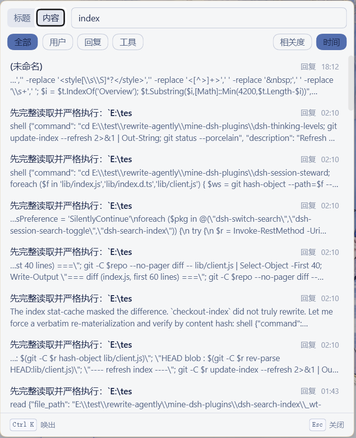

<p align="center">
  <strong>Une recherche de sessions avec son propre index pour la barre latérale de DeepSeek Harness — bascule en un clic entre titre et contenu, avec filtrage par utilisateur / réponse / outil</strong>
</p>
<p align="center">
  <a href="README.md">简体中文</a> · <a href="README.en.md">English</a> · <strong>Français</strong> · <a href="README.de.md">Deutsch</a> · <a href="README.it.md">Italiano</a> · <a href="README.ru.md">Русский</a> · <a href="README.es.md">Español</a>
</p>
<p align="center">
  <a href="LICENSE"></a>
  
</p>

# dsh-search-index

> **Index de recherche** pour la barre latérale du web DSH : ajoute une entrée **« Recherche »** en bas de la barre latérale, dont le panneau flottant bascule en un clic entre **recherche par titre ↔ recherche par contenu** ; le mode contenu affiche titres et extraits **regroupés par session**, avec filtrage par catégorie **utilisateur / réponse / outil**. Embarque un **index indépendant** (sans dépendre de l'index plein texte officiel de DSH), prenant en charge la synchronisation incrémentale, la consolidation non destructive et l'export/import d'instantanés.

> **Ce paquet ne gère que la recherche et l'index.** La consultation et le nettoyage de l'historique des sessions (l'ancien panneau « sessions archivées ») ont migré vers l'onglet « Salle des dossiers » de **`dsh-session-steward`** ; ce paquet **lit** toujours l'ensemble d'archives officiel pour écarter les sessions archivées de l'index, mais ne l'**écrit** plus — l'ensemble d'archives n'a qu'un seul écrivain : le steward. Le contrat est décrit dans `dsh-归档文件格式契约-20260914.md`.

Aucune modification du code source de dsh, aucune PR à soumettre : un client cordis et une moitié hôte de plugin assemblés via la commande `dsh plugin` et un patch de bundle.

## Prédécesseur et version actuelle

**Prédécesseur : `dsh-session-search-toggle`.** Cette version dépendait du `defineStore` de `@deepseek-ai/dsh-client-runtime` pour fournir le siège de la ligne de réglages. DSH 0.1.2 a renommé et restructuré les paquets moteurs du client (`dsh-client-runtime` → `dsh-client-store`), si bien que l'ancien code ne pouvait plus se charger sur le nouvel hôte — un même plugin ne pouvait pas couvrir les deux versions avec un seul artefact.

**La présente version (`dsh-search-index` 0.6.0) prend DSH 0.2.0 comme ligne principale** (peer `>=0.2.0-rc.1 <0.2.1-0`). Les lignes d'hôtes historiques sont servies par des lignes de versions distinctes : DSH 0.1.7 est servi par 0.5.7 (dist-tag npm `dsh-0.1.7`, branche `compat/0.1.7`), et les hôtes 0.1.1/0.1.2 plus anciens utilisent l'artefact historique, qui n'évolue plus avec la présente version. Contexte historique :

- **Un seul artefact, adaptatif à l'exécution** : le même `lib/client.js` se charge aussi bien sur 0.1.1-rc.2 que sur 0.1.2-rc.1, **sans la moindre branche sur une chaîne de version**. Le bundle client ne `require` que `react` / `react-dom`, tous deux présents dans la table de modules partagée des deux versions.
- **Aucun des deux paquets moteurs n'est importé** : ni `dsh-client-runtime`, ni `dsh-client-store` — le plugin **n'est donc pas affecté par ce renommage**.
- **Siège store implémenté localement** : la ligne de réglages a besoin d'un siège store (`StoreHandle` / `StoreInstance`, contrat détenu par `@deepseek-ai/dsh-client-ui-slots` et identique dans les deux versions). Ce plugin remplace `defineStore` par une implémentation locale d'une trentaine de lignes — elle ne dépend que de `create()` → `{ actions, getSnapshot, subscribe, clearPersisted }`, sans aucun specifier propre à une version.
- **Tous les autres contrats sont identiques entre les deux versions** : le slot `settings.general.item`, `SettingsScope.{getSnapshot,subscribe,set,unset}` et les trois faces de requête de `sessionQuery` ont les mêmes signatures dans les deux.

> **▼ Compatibilité des versions de DSH**
> | Version de DSH | Statut | Vecteur et différence clé |
> | --- | --- | --- |
> | 0.2.0-rc.1 | ✅ | **présente version 0.6.0** ; peer/engines = `>=0.2.0-rc.1 <0.2.1-0`, zéro modification de code (consommation purement caller des sièges slots/locale/configForms) |
> | 0.1.7-rc.1+ | ✅ | 0.5.7 (dist-tag `dsh-0.1.7`) ; configForms résout le handle par entry id, les hôtes anciens retombent sur settingsScope lié par espace de noms |
> | 0.1.1-rc.2 | ✅ (artefact ancien, figé) | le moteur store se trouve dans `@deepseek-ai/dsh-client-runtime/client` |
> | 0.1.2-rc.1 | ✅ (artefact ancien, figé) | le moteur a été renommé `@deepseek-ai/dsh-client-store` ; ce plugin n'importe ni l'un ni l'autre |

**Mise à niveau depuis l'ancien nom** : ce paquet est le renommage de `dsh-session-search-toggle` ; l'id d'enregistrement client, l'id de patch cordis et l'URL du dépôt ont été renommés avec lui. GitHub conserve les redirections pour les dépôts renommés, l'ancien nom reste donc résoluble — mais basculez la dépendance de profil vers le nouveau nom plutôt que de laisser les deux coexister durablement :

```sh
dsh plugin --profile web add github:drscrewdriver/dsh-search-index#master
dsh plugin --profile web remove dsh-session-search-toggle
dsh web   # redémarrer
```

L'espace de noms des réglages reste `switch-search` (**clé de stockage inchangée, aucune migration**), la configuration existante continue donc de fonctionner sous le nouveau paquet.

## Ce qu'il fait

- **Double mode titre ↔ contenu** : une entrée, deux façons de chercher — « Titre » filtre en direct par sous-chaîne du titre de session / répertoire de travail ; « Contenu » interroge **l'index indépendant construit par ce plugin** dans le corps des messages de session.
- **Contenu regroupé par session** : chaque résultat de recherche de contenu tient sur une ligne par session (titre de session + extrait le plus pertinent + étiquette de type) ; un clic ouvre la session, sans défilement message par message.
- **Filtre par type de contenu** : puces de filtrage en tête du mode contenu — **Tout / Utilisateur / Réponse / Outil** ; `Outil` ouvre les événements `tool/call` et `tool/result` aux résultats, pour chercher directement dans les arguments et valeurs de retour des appels d'outils.
- **Tri des résultats** : **Pertinence / Date** à droite de la même ligne — « Date » trie par **dernière activité de la session**, les sessions touchées le plus récemment en premier ; la préférence est mémorisée localement et survit aux rechargements. Chaque résultat transmet à la fois l'horodatage du document et celui de la session, le front-end peut donc retrier à sa guise.
- **Titres en temps réel** : l'hôte s'abonne à `session/event` ; un renommage (`session/title`) est replié dans l'index immédiatement, sans attendre la prochaine synchronisation (30 s par défaut).
- **Carte de réglages** : Réglages → Plugins accueille une carte **« Index de recherche »** — interrupteur d'activation, mode de recherche par défaut, réglages de synchronisation / rétention / répertoire de l'index indépendant, et bloc cycle de vie de l'index (statut, consolidation non destructive, export/import d'instantanés). Lorsqu'elle signale « N session(s) archivée(s) exclue(s) », elle **renvoie sur place vers le responsable** : la consultation et le nettoyage des sessions archivées incombent au **« steward de sessions »** (`dsh-session-steward`), ce plugin se contentant de lire l'ensemble d'archives ; si celui-ci n'est pas installé, le message le dit explicitement (« actuellement non installé ») — le diagnostic est établi par l'hôte en le résolvant depuis le **graphe de modules du plugin lui-même**, et en cas de résultat indéterminé un libellé neutre est affiché : on ne rapporte **jamais « illisible » comme « non installé »**.
- **Touche d'invocation et raccourcis affichés selon la plateforme** : l'entrée de la barre latérale et la barre de touches au bas du panneau affichent la touche d'invocation — `⌘K` sur macOS, `Ctrl K` sous Windows/Linux, déterminé d'après le système en cours ; la touche de fermeture du panneau suit elle aussi la plateforme (`esc` sur macOS, `Esc` ailleurs). La détection descend en cascade **UA-CH → `navigator.platform` → chaîne UA**, un mode privé ne dégrade donc jamais un utilisateur Mac vers les symboles Windows. **Libellé et liaison partagent la même source** : l'accord affiché sur la pastille est exactement celui que le gestionnaire `keydown` reconnaît — jamais « une touche annoncée, une autre interceptée ».
- **Accès direct au clic** : cliquer un résultat ouvre la session correspondante, en se positionnant sur le contexte de l'occurrence.

## Aperçu de l'interface

Disposition de l'entrée de recherche dans la barre latérale et du panneau de recherche :




## L'index indépendant : trois mécanismes

Le mode contenu **construit sa propre base**, sans dépendre de l'index plein texte officiel `session-query-sqlite` de DSH. L'index vit dans `src/host/` : `schema.ts` crée les tables (dont la table FTS5 maison `docs_fts`), `engine.ts` exécute les requêtes et `extract.ts` extrait le texte indexable des événements de session (y compris le nom et les arguments de l'outil pour `tool/call`, et le texte du résultat pour `tool/result` — la base de données du « filtre outil »). Le `sessionQuery` de DSH n'est utilisé que comme **lecteur de corpus** (`listSessions` / `readSession`), jamais comme moteur de recherche.

### 1. Un index indépendant du contenu des sessions

L'index est le **fichier SQLite propre à ce plugin**, sans aucune interaction avec l'index officiel. Répertoire de persistance configurable, export/import par instantané, reconstruction complète possible. À l'activation de l'hôte, le répertoire de l'index est inspecté : un `index.building.sqlite` inachevé alors qu'un index active existe est jugé « la dernière reconstruction ne s'est pas terminée » et simplement jeté ; s'il n'y a pas d'index active, c'est que « le crash est survenu pendant la fenêtre de renommage » et le plus récent des archivés est restauré comme active.

### 2. Les sessions hors d'usage sont purgées selon les archives, avec mise à jour continue

`archive-source.ts` lit `global.archivedSessionIds` dans le hub de stockage officiel `~/.dsh/storages/workspace.json` et tient **les sessions archivées (donc inutilisables) hors de l'index**. L'ensemble d'archives n'a qu'un seul écrivain — le steward ; ce paquet se contente de le lire.

La synchronisation est **glissante** : `SwitchWatermarkSync` dans `sync.ts` tient un filigrane `version` par session et, à chaque passe, ne compare que les différences et ne réingère que les sessions modifiées — jamais de reconstruction totale. Les fichiers d'index eux-mêmes sont conservés en nombre borné selon `archiveKeep`, les plus anciens étant éliminés automatiquement.

### 3. La consolidation n'interrompt jamais l'index en service

La consolidation passe par un **index fantôme** : `rebuild.ts` construit `index.building.sqlite` de zéro à côté de l'index active, et pendant toute la construction **l'index active continue de servir les recherches** — rien n'est bloqué. À la fin, la bascule se fait par trois `rename` synchrones (active → archive, shadow → active) : une seule fenêtre atomique.

D'où la sémantique d'échec : **fantôme présent + active présent = construction inachevée** ; le fantôme est alors un déchet, jeté sans cérémonie — l'index active n'a jamais été en danger.

## Installation

```sh
# Option 1 : installation directe depuis GitHub (recommandée) — lib/ est committé, pas de build local nécessaire
dsh plugin --profile web add github:drscrewdriver/dsh-search-index#master

# Option 2 : assemblage depuis un chemin local / les sources (voir la section « Développement »)

# Redémarrer dsh web — obligatoire ! Une instance en cours ne recharge pas à chaud la couche bundle
dsh web
```

Après l'installation, un bouton **« Recherche »** apparaît en bas de la barre latérale ; Réglages → Plugins gagne la carte **« Index de recherche »**.

> ⚠️ **Accessibilité réseau de GitHub** : l'installation via github: suppose que github.com est joignable ; sur un réseau restreint, configurez d'abord un proxy ou un miroir fonctionnel, sinon `add` restera bloqué à l'étape de récupération.

## Développement

```sh
pnpm install            # inclut la chaîne de paquets client @deepseek-ai + tsdown/tsc
pnpm typecheck          # tsc --noEmit
pnpm build              # tsc(lib/types) + tsdown(lib/index.mjs + lib/client.js)
```

### Structure des sources

```
src/
├── index.ts            # moitié hôte (node) : schéma Config + installSettingsSection + routes
├── config.ts           # configuration pure partagée (enabled/defaultMode + constante d'espace de noms, pas de schemastery côté client)
├── host/               # l'index indépendant (côté hôte)
│   ├── schema.ts       # tables : docs / docs_fts(FTS5) / sessions / filigranes
│   ├── engine.ts       # requêtes
│   ├── extract.ts      # extrait le texte indexable des événements de session (tool/call et tool/result inclus)
│   ├── sync.ts         # SwitchWatermarkSync : synchro incrémentale glissante par filigrane de version
│   ├── rebuild.ts      # construction fantôme + bascule atomique + inspection de reprise après crash
│   ├── archive-source.ts  # lit l'ensemble d'archives pour écarter les sessions archivées de l'index
│   └── snapshot.ts     # export/import d'instantanés
└── client/
    └── index.ts        # moitié navigateur : entrée sidebar.footer.action + panneau flottant + ligne settings.general.item
```

- **Moitié hôte** : enregistre la route HTTP cloisonnée `/switch-search/api` (`list-sessions` / `content-search` / `search-status`), avec une barrière de confiance navigateur identique à la passerelle `/api` de DSH (Host en loopback ou trustedHosts ; cross-site refusé).
- **Schéma de configuration** : l'hôte enregistre l'espace de noms `switch-search` via le service `settings` + un `Config` schemastery ; la moitié client le lit et l'écrit en miroir avec un siège store local + `settingsScope.bind` ; le module pur partagé `src/config.ts` maintient le bundle client exempte de schemastery.
- **Chaîne de build** : tsdown reproduit la sémantique de `packages/client/tsdown.client.ts` du harness (bandeau `__ModuleLoader__.load`, table d'externals par plateforme, garde de pureté du bundle).
- **lib/ committé dans le dépôt** : les installations GitHub s'exécutent avec l'artefact de build déjà commité (dsh ne lance pas `prepare` pour une installation git) ; `.gitignore` n'exclut pas `lib/`.

## Relation avec la recherche officielle de la barre latérale

- La boîte de recherche officielle vit dans `sidebar.workspaces` (slot unique), qu'un plugin externe **ne peut pas remplacer** ; ce plugin **ajoute une entrée distincte** en bas de la barre latérale via `sidebar.footer.action` — les deux coexistent sans se gêner.
- La recherche de contenu officielle est codée en dur dans l'apiproxy et ne couvre que `user/message` + `assistant/message` ; ce plugin interroge son propre index et ouvre `tool/call` + `tool/result`, pour une recherche au niveau des outils.

## Compatibilité et confidentialité

- Suppose DeepSeek Harness installé avec le profil web ; **aucun code officiel n'est modifié**. L'index est le fichier propre de ce plugin : que `session-query-sqlite` officiel soit activé ou non n'a aucune incidence.
- La configuration ne vit que dans l'espace de noms settings de DSH et dans l'état du panneau côté navigateur ; rien n'est lu ni téléversé au-delà des données de recherche de sessions.
- Les types de contrat hôte/client sont déclarés structurellement dans `src/*.ts` (la chaîne des paquets client dsh sur npm est incomplète) et vérifiés contre les sources du harness au moment du build.

## La famille de plugins DSH de drscrewdriver

Ce projet fait partie de la série de plugins DSH maintenue par [drscrewdriver](https://github.com/drscrewdriver). Si celui-ci vous est utile, les autres le seront probablement aussi :

| Plugin | En une ligne |
|---|---|
| [dsh-input-traffic](https://github.com/drscrewdriver/dsh-input-traffic) | File d'attente de saisie en charge pour le DSH Web GUI : régulation à trois niveaux, réorganisation par glisser-déposer, gel des sessions |
| [dsh-thinking-levels](https://github.com/drscrewdriver/dsh-thinking-levels) | Contrôle du reasoning_effort tour par tour : planification Auto intelligente ou palier fixe manuel |
| [dsh-seatbelt-sandbox](https://github.com/drscrewdriver/dsh-seatbelt-sandbox) | Adaptateur de bac à sable macOS Seatbelt : loader natif libsandbox, successeur du sandbox-exec déprécié |
| [dsh-prime-memory](https://github.com/drscrewdriver/dsh-prime-memory) | Mémoire distillée en couches : distillation automatique L0~L3, injection du rappel avant chaque étape du modèle |
| **[dsh-search-index](https://github.com/drscrewdriver/dsh-search-index)** | Recherche de sessions en barre latérale : bascule titre/contenu, filtrage par utilisateur/réponse/outil |

## License

MIT
